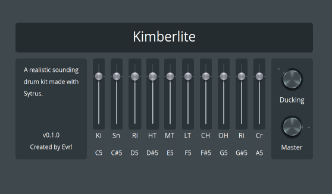

# Kimberlite

A realistic, velocity dynamic drum kit built for FL Studio's [Patcher](https://www.image-line.com/fl-studio-learning/fl-studio-online-manual/html/plugins/Patcher.htm), synthesized with [Sytrus](https://www.image-line.com/fl-studio-learning/fl-studio-online-manual/html/plugins/Sytrus.htm). Requires [FL Studio](https://www.image-line.com/) version 25.2.4 or later.



## Contents

- [Full drum kit preset](kit/)
- [Individual drum sound presets](presets/)
- [Audio demo](demo/Kimberlite_Demo.wav)

## Installation

Copy the `.fst` files to your FL Studio Patcher presets directory:

**Windows:**
```
C:\Users\<username>\Documents\Image-Line\FL Studio\Presets\Plugin presets\Generators\Patcher
```

**macOS:**
```
/Users/<username>/Documents/Image-Line/FL Studio/Presets/Plugin presets/Generators/Patcher
```

## License

"Kimberlite" © 2026 by @Everither is licensed under CC BY-NC 4.0